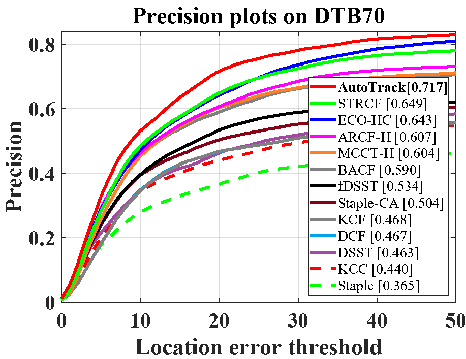
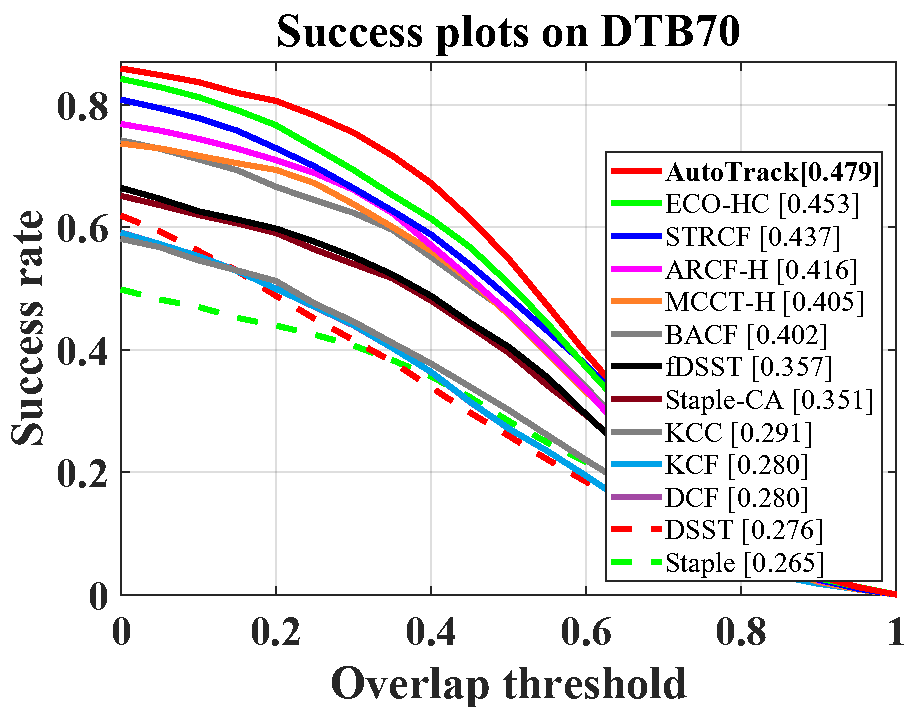
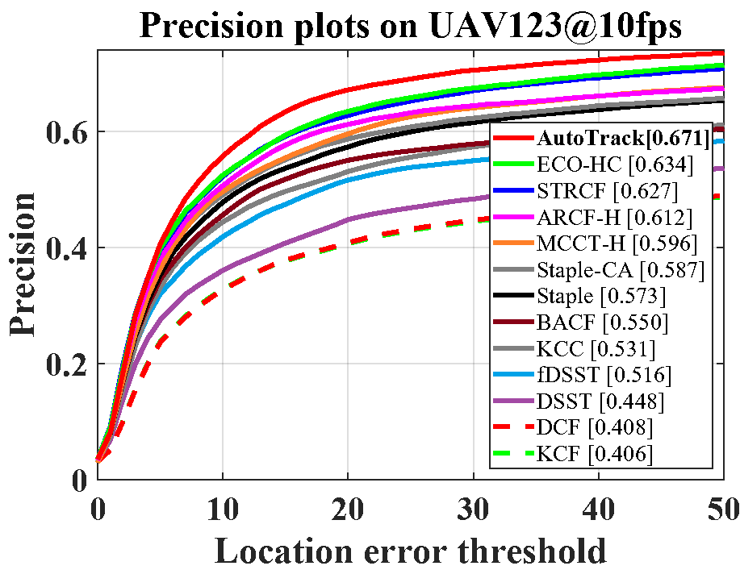
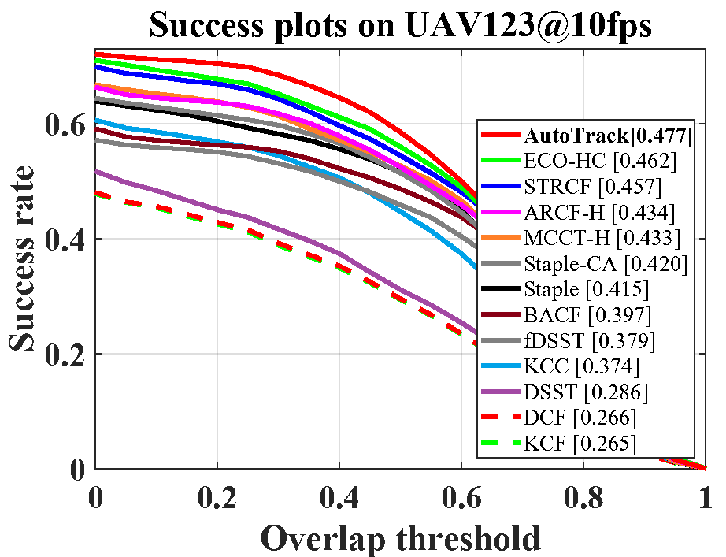
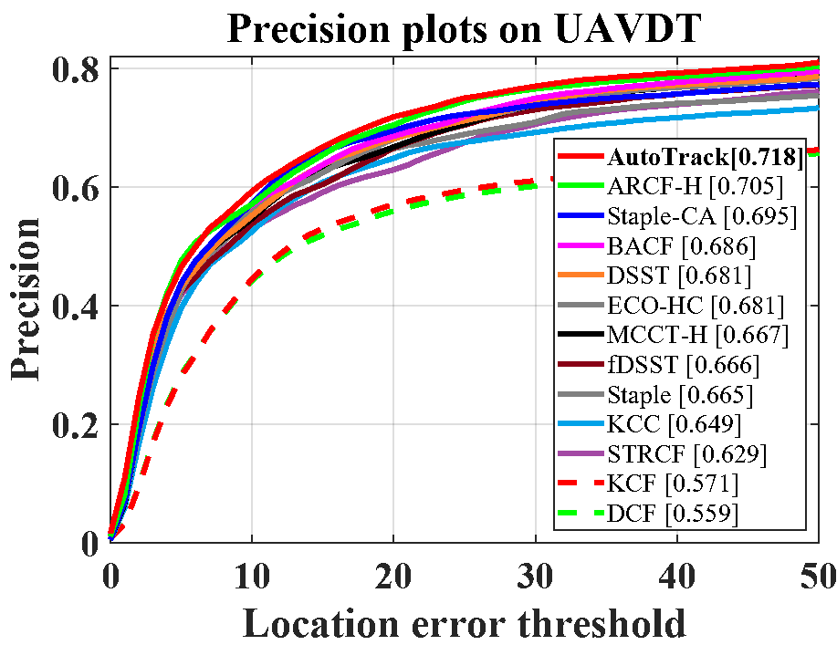
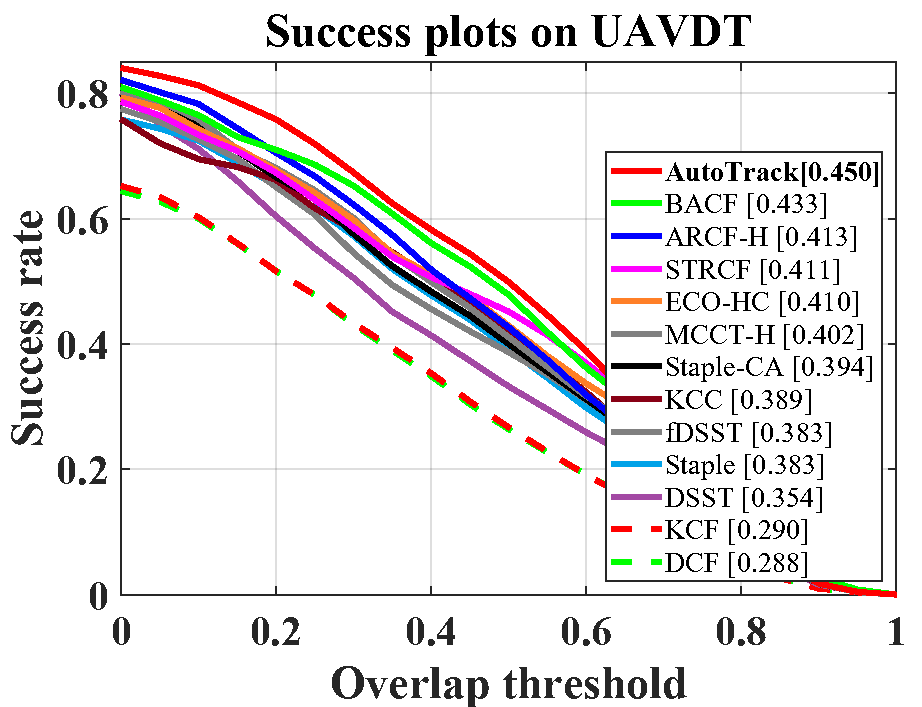
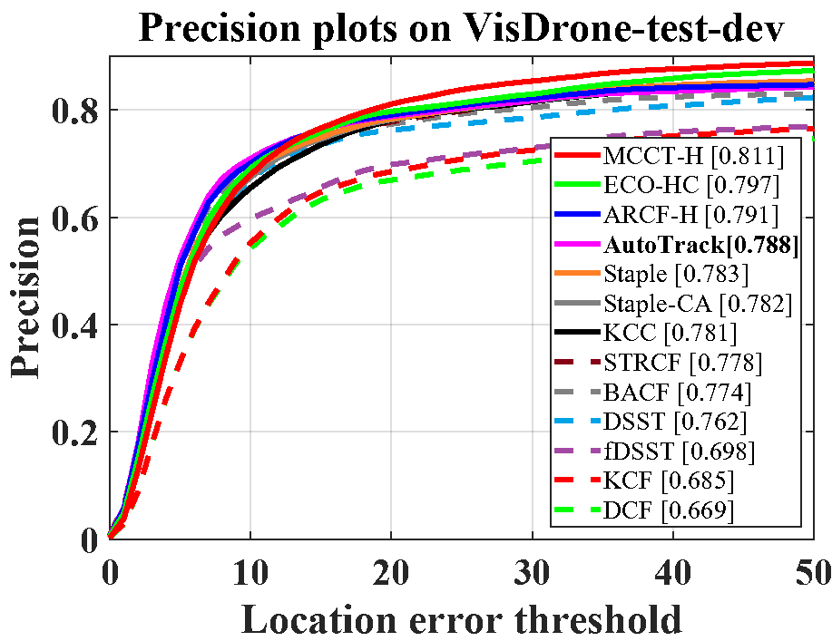
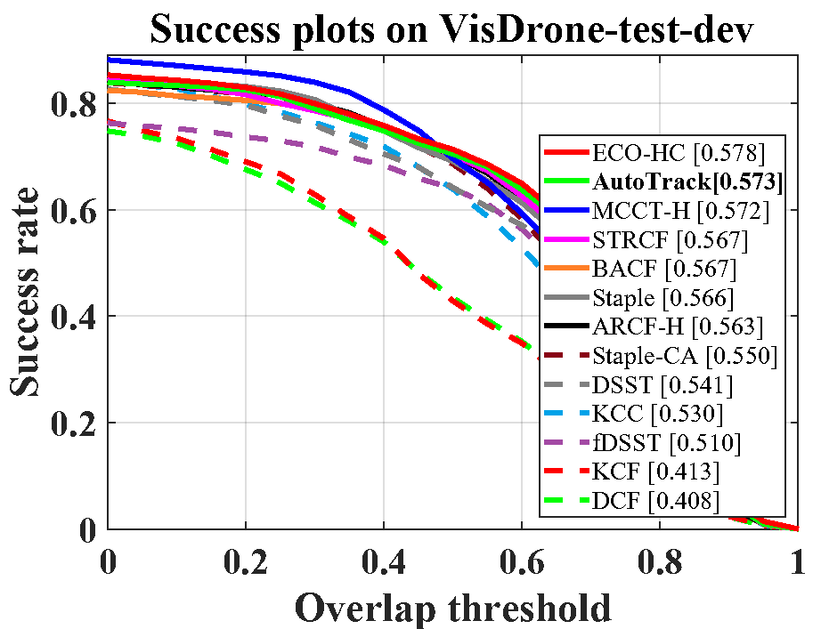

# AutoTrack:  Towards High-Performance Visual Tracking for UAV with Automatic Spatio-Temporal Regularization

Matlab implementation of our automatic spatial-temporal regularization tracker (AutoTrack).

The code for UAV localization is coming soon.

The paper can be found here: https://arxiv.org/abs/2003.12949. 

# Abstract

Most existing trackers based on discriminative correlation filters (DCF) try to introduce predefined regularization term to improve the learning of target objects, e.g., by suppressing background learning or by restricting change rate of correlation filters. However, predefined parameters introduce much effort in tuning them and they still fail to adapt to new situations that the designer didn’t think of. In this work, a novel approach is proposed to online automatically and adaptively learn spatio-temporal regularization term. Spatially local response map variation is introduced as spatial regularization to make DCF focus on the learning of trust-worthy parts of the object, and global response map variation determines the updating rate of the filter. Extensive experiments on four UAV benchmarks, i.e., DTB70, UAVDT, UAV123@10fps and VisDrone-test-dev, have proven that our tracker performs favorably against the state-of-theart CPU- and GPU-based trackers, with average speed of 59.2 frames per second (FPS) running on a single CPU.
Our tracker is additionally proposed to be applied to localize the moving camera. Considerable tests in the indoor practical scenarios have proven the effectiveness and versatility of our localization method.

# Publication and citation

AutoTrack is proposed in our paper accepted by CVPR 2020. Detailed explanation of our method can be found in the paper:

Yiming Li, Changhong Fu, Fangqiang Ding,  Ziyuan Huang and Geng Lu

AutoTrack:  Towards High-Performance Visual Tracking for UAV with Automatic Spatio-Temporal Regularization.

In Proceedings of the IEEE/CVF Conference on Computer Vision and Pattern Recognition  (CVPR), 2020

Please cite the aforementioned publication when you compare AutoTrack in your work. Bibtex entry:

> @Inproceedings{Li2020CVPR,
>
> title={AutoTrack:  Towards High-Performance Visual Tracking for UAV with Automatic Spatio-Temporal Regularization}, 
>
> author={Li, Yiming and Fu, Changhong and Ding, Fangqiang and Huang, Ziyuan and Lu, Geng},
>
> booktitle={CVPR},
>
> year={2020},
>
> }

# Contact

Yiming Li

yimingli9702@gmail.com

Changhong Fu

Email: [changhong.fu@tongji.edu.cn](mailto:changhong.fu@tongji.edu.cn)

Fangqiang Ding

Email: dfq.toytiny@gmail.com

# Demonstration running instructions

This code is compatible with UAV123@10fps, DTB70, UAVDT and VisDrone-test-dev benchmark. Therefore, if you want to run it in benchmark, just put AutoTrack folder in trackers, and config sequences and trackers according to instructions from aforementioned benchmarks. 

# Results on UAV datasets

### DTB70

### UAV123@10fps

### UAVDT

### VisDrone-test-dev

# Acknowledgements

We thank the contribution of  Feng Li, Ning Wang and Martin Danelljan for their previous work STRCF,  MCCT-H and DSST.  The feature extraction modules and some of the parameter are borrowed from the MCCT tracker (https://github.com/594422814/MCCT). The scale estimation method is borrowed from the DSST tracker (http://www.cvl.isy.liu.se/en/research/objrec/visualtracking/scalvistrack/index.html).

